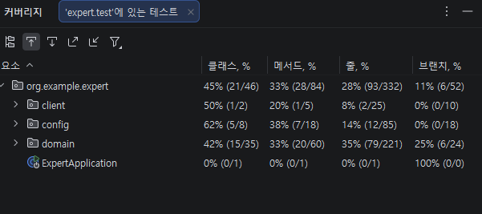

# 🌱 Spring 3기 CH 3 심화 - 코드 개선 과제

---

## 📋 목차

- [Lv 0. 프로젝트 세팅 - 에러 분석](#lv-0-프로젝트-세팅---에러-분석)
- [Lv 1. ArgumentResolver](#lv-1-argumentresolver)
- [Lv 2. 코드 개선](#lv-2-코드-개선)
- [Lv 3. N+1 문제](#lv-3-n1-문제)
- [Lv 4. 테스트코드 연습](#lv-4-테스트코드-연습)
- [Lv 5. API 로깅](#lv-5-api-로깅)
- [Lv 6. 내가 정의한 문제와 해결 과정](#lv-6-내가-정의한-문제와-해결-과정)
- [Lv 7. 테스트 커버리지](#lv-7-테스트-커버리지)

---

## Lv 0. 프로젝트 세팅 - 에러 분석

프로젝트 실행 시 발생한 에러의 원인을 분석하고 실행 가능한 상태로 수정했습니다.

- 발생한 에러를 정확히 파악하고, 원인이 되는 코드를 수정하여 애플리케이션이 정상적으로 구동되도록 했습니다.

---

## Lv 1. ArgumentResolver

`org.example.expert.config` 패키지의 `AuthUserArgumentResolver` 클래스의 누락된 로직을 복구했습니다.

- `supportsParameter()` 메서드에서 `@AuthUser` 어노테이션이 붙은 파라미터를 인식하도록 구현했습니다.
- `resolveArgument()` 메서드에서 JWT 토큰을 기반으로 인증된 사용자 정보를 `AuthUser` 객체로 변환하여 반환하도록 구현했습니다.

---

## Lv 2. 코드 개선

### 1. Early Return

`org.example.expert.domain.auth.service.AuthService`의 `signup()` 메서드를 리팩토링했습니다.

**Before**
```java
String encodedPassword = passwordEncoder.encode(signupRequest.getPassword());

if (userRepository.existsByEmail(signupRequest.getEmail())) {
    throw new InvalidRequestException("이미 존재하는 이메일입니다.");
}
```

**After**
```java
if (userRepository.existsByEmail(signupRequest.getEmail())) {
    throw new InvalidRequestException("이미 존재하는 이메일입니다.");
}

String encodedPassword = passwordEncoder.encode(signupRequest.getPassword());
```

- 이메일 중복 검사를 `passwordEncoder.encode()` 호출 이전으로 이동하여, 이미 존재하는 이메일인 경우 불필요한 암호화 연산이 실행되지 않도록 개선했습니다.

---

### 2. 불필요한 if-else 제거

`org.example.expert.client.WeatherClient`의 `getTodayWeather()` 메서드를 리팩토링했습니다.

**Before**
```java
WeatherDto[] weatherArray = responseEntity.getBody();
if (!HttpStatus.OK.equals(responseEntity.getStatusCode())) {
    throw new ServerException("날씨 데이터를 가져오는데 실패했습니다. 상태 코드: " + responseEntity.getStatusCode());
} else {
    if (weatherArray == null || weatherArray.length == 0) {
        throw new ServerException("날씨 데이터가 없습니다.");
    }
}
```

**After**
```java
WeatherDto[] weatherArray = responseEntity.getBody();
if (!HttpStatus.OK.equals(responseEntity.getStatusCode())) {
    throw new ServerException("날씨 데이터를 가져오는데 실패했습니다. 상태 코드: " + responseEntity.getStatusCode());
}
if (weatherArray == null || weatherArray.length == 0) {
    throw new ServerException("날씨 데이터가 없습니다.");
}
```

- 불필요한 `else` 블록을 제거하여 가독성을 향상시켰습니다.

---

### 3. Validation 개선

`org.example.expert.domain.user.service.UserService`의 `changePassword()` 메서드에서 직접 수행하던 유효성 검사를 요청 DTO로 이동했습니다.

- `spring-boot-starter-validation` 라이브러리를 활용하여 `UserChangePasswordRequest` DTO에 `@NotBlank`, `@Size`, `@Pattern` 등의 어노테이션을 적용했습니다.
- 서비스 레이어의 유효성 검사 코드를 제거하여 관심사를 분리하고 코드를 간결하게 했습니다.

---

## Lv 3. N+1 문제

`TodoRepository`의 JPQL fetch join 기반 구현을 `@EntityGraph` 방식으로 변경했습니다.

**Before**
```java
@Query("SELECT t FROM Todo t LEFT JOIN FETCH t.user")
Page<Todo> findAllByOrderByModifiedAtDesc(Pageable pageable);
```

**After**
```java
@EntityGraph(attributePaths = {"user"})
@Query("""
        SELECT t FROM Todo t
        ORDER BY t.modifiedAt DESC
        """)
Page<Todo> findAllByOrderByModifiedAtDesc(Pageable pageable);

@EntityGraph(attributePaths = {"user"})
@Query("""
        SELECT t FROM Todo t 
        WHERE t.id = :todoId
        """)
Optional<Todo> findByIdWithUser(@Param("todoId") Long todoId);
```

- `@EntityGraph`를 사용하면 JPQL 없이도 연관 엔티티를 즉시 로딩할 수 있어 N+1 문제를 해결할 수 있습니다.

---

## Lv 4. 테스트코드 연습

### 1. `matches_메서드가_정상적으로_동작한다()`

- `PasswordEncoderTest`에서 잘못 작성된 테스트를 수정하여 `matches()` 메서드가 정상 동작하도록 구현하였습니다.

### 2-1. `manager_목록_조회_시_Todo가_없다면_NPE_에러를_던진다()`

- 실제로 던지는 예외가 `NullPointerException`이 아닌 `InvalidRequestException`임을 확인하고, 테스트 코드 및 메서드명을 수정했습니다.
- 수정된 메서드명: `manager_목록_조회_시_Todo가_없다면_IRE_에러를_던진다()`

### 2-2. `comment_등록_중_할일을_찾지_못해_에러가_발생한다()`

- 실제 코드 확인시 `InvalidRequestException` 부분이 `ServerException`으로 되어있어서 수정.
- 또한 테스트 코드 실행시 '필요'와 '실제'로 나누어 에러부분에 표기해주어 이를 토대로 수정함

### 2-3. `todo의_user가_null인_경우_예외가_발생한다()`

- `Todo`의 `user`가 `null`일 때 예외가 발생하도록 서비스 로직을 아래와 같이 수정했습니다.
```
  //ManagerService>saveManager > to_do의 유저가 null인지 체크하는 코드 추가
    if (todo.getUser() == null || !ObjectUtils.nullSafeEquals(user.getId(), todo.getUser().getId())) {
        throw new InvalidRequestException("일정을 생성한 유저만 담당자를 지정할 수 있습니다.");
    }
 ```

---

## Lv 5. API 로깅

어드민 사용자만 접근 가능한 API에 대한 접근 로그를 **AOP**를 활용하여 구현했습니다.

이유 : Interceptor는 Controller단에서 HTTP 요청(Request/Response)자체를 가로채고 Aop는 Method실행자체를 가로채는데 문제에 요구사항에 Logging이 적용될 부분이 Controller 내부의 특정 Method이기 때문에 Aop를 선택하게 되었다.
### AOP
- `AdminApiLoggingAspect`를 구현하여 `@Around` 어노테이션으로 어드민 API 메서드 실행 전후를 감지합니다.
- 요청한 사용자 ID, API 요청 시각, URL, 요청/응답 본문(JSON)을 로깅합니다.

**대상 메서드:**
- `CommentAdminController.deleteComment()`
- `UserAdminController.changeUserRole()`

---

## Lv 6. 내가 정의한 문제와 해결 과정
## 🚀 트러블슈팅: 댓글 삭제 API의 멱등성 및 예외 처리 개선

### 1. 문제 인식 (Issue)
*   **상황**: 포스트맨으로 관리자 댓글 삭제 API 테스트 중, 이미 삭제된 댓글 ID로 재요청을 보내도 계속 `200 OK`가 응답되는 현상 발생.
*   **기대 결과**: 이미 삭제되어 존재하지 않는 댓글일 경우, 사용자에게 적절한 예외 메시지와 에러 코드(예: 404 Not Found)를 반환해야 함.

### 2. 원인 분석 (Analysis)
*   **코드 확인**: 기존 `deleteById` 메서드는 내부적으로 해당 엔티티가 있는지 검증하지 않거나, Spring Data JPA의 기본 동작에 따라 데이터가 없어도 별도의 예외를 던지지 않고 로직이 종료됨.
*   **판단**: "존재하지 않는 자원"에 대한 명시적인 예외 처리가 누락되어 시스템의 신뢰성이 떨어지는 상태로 파악됨.

### 3. 해결 방안 및 구현 (Resolution)
*   **해결 로직**: `deleteById`를 바로 호출하는 대신, `findById`를 통해 먼저 존재 여부를 확인하고, 데이터가 없을 경우 `EntityNotFoundException`을 명시적으로 발생시키도록 수정.

#### 🛠 코드 수정 전/후 비교

| 구분 | 수정 전 (Before) | 수정 후 (After) |
| :--- | :--- | :--- |
| **핵심 로직** | 단순 `deleteById` 호출 | 존재 여부 확인 후 삭제 |
| **응답 상태** | 무조건 `200 OK` | 존재 시 `200 OK` / 미존재 시 **404(예외 발생)** |

```java
// 수정 후 코드 예시
@Transactional
public void deleteComment(long commentId) {
    // 1. 댓글 존재 여부 확인 및 예외 처리
    commentRepository.findById(commentId)
            .orElseThrow(() -> new EntityNotFoundException("Comment not found"));

    // 2. 존재할 경우 삭제 수행
    commentRepository.deleteById(commentId);
}
```

---

## Lv 7. 테스트 커버리지

<!-- IntelliJ에서 Run with Coverage 실행 후 캡처한 이미지를 아래에 삽입하세요 -->




